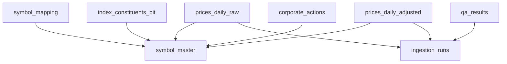

# Canonical Data Schema (T-004)

This document describes the initial warehouse schema and migration baseline for research workloads.

## Migration Baseline

- EF migration: `InitialCanonicalSchema`
- Context: `DataWarehouse.Schema.ResearchWarehouseDbContext`
- Migration files:
  - `src/Modules/DataWarehouse/Schema/Migrations/20260301131711_InitialCanonicalSchema.cs`
  - `src/Modules/DataWarehouse/Schema/Migrations/ResearchWarehouseDbContextModelSnapshot.cs`

## Entity Relationship Overview



## Tables and Purpose

### `symbol_master`
Canonical instrument registry used as the root entity for all time-series and metadata.

Key columns:
- `Id` (PK)
- `Symbol` (unique)
- `Name`, `ExchangeMic`, `AssetType`, `Currency`, `IsActive`
- `ListedDate`, `DelistedDate`, `CreatedUtc`, `UpdatedUtc`

### `symbol_mapping`
Maps provider-specific symbols to canonical instruments across effective date ranges.

Key columns:
- `Id` (PK)
- `SymbolMasterId` (FK -> `symbol_master`)
- `Provider`, `ProviderSymbol`
- `EffectiveFrom`, `EffectiveTo`

Key constraints/indexes:
- Unique: `(Provider, ProviderSymbol, EffectiveFrom)`
- Check: `effective_to IS NULL OR effective_to >= effective_from`

### `index_constituents_pit`
Point-in-time index membership history for SP500/SP100 and future universes.

Key columns:
- `Id` (PK)
- `IndexCode`, `SymbolMasterId` (FK)
- `EffectiveFrom`, `EffectiveTo`
- `Weight`, `Source`

Key constraints/indexes:
- Unique: `(IndexCode, SymbolMasterId, EffectiveFrom)`
- Check: valid effective date range

### `prices_daily_raw`
Unadjusted daily OHLCV bars from providers.

Key columns:
- `Id` (PK)
- `SymbolMasterId` (FK)
- `TradeDate`, `Open`, `High`, `Low`, `Close`, `Volume`, `Vwap`
- `Provider`
- `IngestionRunId` (nullable FK)

Key constraints/indexes:
- Unique: `(SymbolMasterId, TradeDate, Provider)`
- Check: OHLC ordering and non-negative volume

### `corporate_actions`
Corporate action events used for adjustments and auditability.

Key columns:
- `Id` (PK)
- `SymbolMasterId` (FK)
- `ActionDate`, `ActionType`, `Value`
- `Currency`, `Provider`, `ExternalId`, `Description`

Key constraints/indexes:
- Unique: `(SymbolMasterId, ActionDate, ActionType, Provider, Value)`

### `prices_daily_adjusted`
Adjusted daily bars with explicit adjustment factor and basis.

Key columns:
- `Id` (PK)
- `SymbolMasterId` (FK)
- `TradeDate`, `Open`, `High`, `Low`, `Close`, `AdjustedClose`
- `AdjustmentFactor`, `AdjustmentBasis`, `Volume`
- `Provider`
- `IngestionRunId` (nullable FK)

Key constraints/indexes:
- Unique: `(SymbolMasterId, TradeDate, Provider)`
- Check: OHLC ordering, non-negative volume, non-negative adjustment factor

### `ingestion_runs`
Operational run ledger for ingestion/reprocessing jobs.

Key columns:
- `Id` (PK)
- `RunId` (unique GUID)
- `Pipeline`, `Provider`, `Status`
- `RequestedAtUtc`, `StartedAtUtc`, `FinishedAtUtc`
- `RequestParametersJson`, `RowsRead`, `RowsInserted`, `RowsUpdated`, `ErrorMessage`

### `qa_results`
Stored QA outcomes tied to ingestion runs.

Key columns:
- `Id` (PK)
- `IngestionRunId` (nullable FK)
- `CheckName`, `Scope`, `Severity`, `Status`
- `AffectedRows`, `DetailsJson`, `CreatedUtc`

## Apply Migrations

```bash
cd /path/to/ResearchPlatform
./scripts/db-migrate.sh
```

Optional runtime override:

```bash
export RP__DataWarehouse__ConnectionString="Data Source=researchplatform.db"
./scripts/db-migrate.sh
```

## Notes

- SQLite is the initial migration target for development/research speed.
- Constraints are intentionally strict to fail fast on invalid market data.
- `T-005` added repository-level symbol master/mapping enrichment over this schema.
- `T-006` added PIT constituent snapshot loading/query access patterns for SP500/SP100 on top of this baseline.
